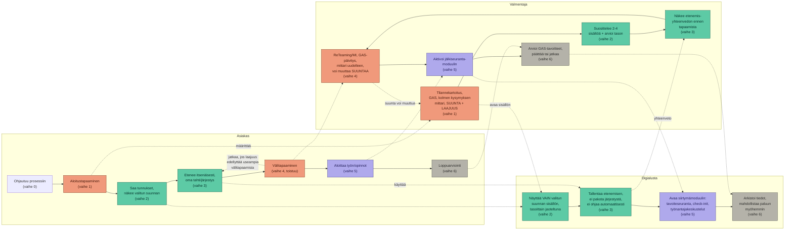

# Digivalmennusalusta — kehittämissuunnitelma

*Asiakkaan eteneminen valmennusprosessissa, alustan rakenne ja sisältö. Kaaviot laadittu JHS 152 -suosituksen (Prosessien kuvaaminen) periaatteita soveltaen.*

---

## Sisällysluettelo

1. Tausta ja lähtökohdat
2. Käyttäjäpersoonat
3. Toimintamalli (JHS 152, taso 2)
4. Tiedonhallinnan malli
5. Asiakkaan palvelupolku (JHS 152, taso 3)
6. Palvelupolun uimaratakaavio
7. Työnkulku (JHS 152, taso 4)
8. Sisällön teoriapohja ja pedagoginen eteneminen
9. Benchmark: Live-säätiön digitaalinen työhönvalmennus
10. Yhteenveto ja seuraavat askeleet

---

## 1. Tausta ja lähtökohdat

Tämä suunnitelma koskee digitaalista alustaa, joka tukee — ei korvaa — kasvokkaista työhönvalmennusta ja muutosturvakoulutusta. Suunnittelu perustuu erilliseen syväanalyysiin (tutkimuskysymykset 1–6, ks. `digivalmennusalusta_syvaanalyysi.md`), josta keskeisimmät johtopäätökset:

- Suomalaisilta digitaalisilta työhönvalmennusalustoilta (mm. Howspace-pohjaiset ratkaisut) puuttuu aito valinnainen modulaarisuus teoreettisesti ankkuroituna — tämä on tunnistettu markkina-aukko.
- Toiveikkuusteoria (goals–pathways–agency), minäpystyvyys ja työn merkityksellisyys (TMT/MEANWELL) ovat operationalisoitavissa alustan sisältörakenteeseen, mutta niiden digitaalinen soveltaminen ilman ihmiskontaktia on tutkimuksen valossa riskialtista erityisesti motivoivan haastattelun (MI) osalta.
- Työsuhteen/opintojen alkuvaiheen tuki on sekä tunnistettu riskikohta että aukko, jota mikään löydetty suomalainen ratkaisu ei vielä täytä.

Näiden pohjalta sovitut ydinperiaatteet, jotka ohjaavat kaikkia alla olevia tuotoksia:

- **Tilanteen, tavoitteiden ja liikkeen suunnan (työllistyminen/opiskeluun ohjaus/osallisuus/muu askel) selvittäminen tapahtuu aina kasvokkaisessa keskustelussa.** Alusta ei ehdota eikä valitse suuntaa.
- **Alustalla edetään vapaasti valitun suunnan sisällä** — ei pakotettua, orjallisesti etenevää ohjelmaa.
- **Modulaarisuus huomioi käyttäjien vaihtelevan osaamisen, koulutustaustan ja oppimiskyvyn** — sama teema tarjolla eri syvyyksinä (matala kynnys / syventävä), ei algoritmista adaptiivisuutta vaan valmentajan arvioon perustuvaa suositusta.
- **Alusta tukee nykyisiä menetelmiä (GAS, ReTeaming/MI, TMT, kolmen kysymyksen mittari) — ei korvaa niitä.** Erityisesti TMT- ja itsereflektiotulokset eivät siirry valmentajalle automaattisesti.

---

## 2. Käyttäjäpersoonat

Persoonat on rakennettu neljän vaihteluakselin varaan, jotka tunnistettiin syväanalyysissä ja suunnitteluperiaatteissa:

1. **Digitaaliset valmiudet** (matala–korkea)
2. **Koulutus-/osaamistausta** (perusaste–korkeakoulu)
3. **Motivaatio/toiveikkuus** (Snyderin goals–pathways–agency: onko reitti epäselvä, usko omaan kykyyn heikko, vai molemmat kunnossa)
4. **Liikkeen suunta** (työllistyminen / opiskeluun ohjaus / osallisuus / muu askel)

Persoonat eivät ole tasaisesti "keskivertokäyttäjiä" vaan tarkoituksella ääripäitä — jotta polku ja sisältö kestävät koko kirjon, ei vain oletuskäyttäjää.

---

### 1. Mika, 24 — matala digitaidot, epäselvä suunta, reitti hukassa

**Tausta:** Peruskoulu + keskeytynyt ammattiopisto. Työhistoriaa lyhyistä pätkätöistä (varasto, keikkatyö). Ei ole koskaan käyttänyt verkko-oppimisalustaa; puhelin on ainoa laite, tietokoneen käyttö vierasta.

**Tilanne valmennuksessa:** Muutosturva-asiakas, tullut prosessiin TE-palvelun ohjaamana. Kasvokkaisessa aloitustapaamisessa "liikkeen suunta" on vielä auki — Mika ei osaa sanoa haluaako työtä vai koulutusta, koska ei tiedä mitä vaihtoehtoja on.

**Toiveikkuus (Snyder):** Matala reitti-ajattelu (ei tiedä vaihtoehtoja) JA matala toimijuus (epäonnistuneet hakemukset ovat syöneet uskoa). Molemmat osa-alueet tarvitsevat tukea.

**Mitä alusta tarjoaa hänelle:** Ei laajaa moduulivalikkoa heti — riski on hukkua vaihtoehtoihin. Valmentaja rajaa kasvokkain 2–3 konkreettista, matalan kynnyksen sisältöä ("tee tämä yksi asia tällä viikolla"). Sisältöjen pitää olla lyhyitä, puhelimella toimivia, mieluiten ääneen luettavia tai video-muotoisia; teksti-intensiiviset itsereflektiotehtävät eivät toimi vielä tässä vaiheessa.

**Riski suunnittelulle:** Jos alusta esittää kaikki teemat tasa-arvoisesti listattuna, Mika joko jättää alustan kokonaan käyttämättä tai valitsee sattumanvaraisesti. Valmentajan "suositus"-toiminto on hänelle välttämätön, ei mukavuus.

---

### 2. Satu, 47 — hyvät digitaidot, korkea koulutus, motivaatio-ongelma pitkittyneen työttömyyden jälkeen

**Tausta:** Korkeakoulututkinto, keskijohdon asiantuntijatehtävä 15 vuotta, irtisanottu yt-neuvotteluissa. Käyttää tietokonetta ja verkkopalveluita sujuvasti työkseenkin.

**Tilanne valmennuksessa:** Muutosturva-asiakas. Suunta on periaatteessa selvä (työllistyminen omalle alalle), mutta yli vuoden kestänyt hakuprosessi on syönyt uskoa. Osaa tehdä CV:n ja hakemukset teknisesti hyvin, mutta ei enää usko niiden vaikuttavan.

**Toiveikkuus (Snyder):** Korkea reitti-ajattelu (tietää mitä pitäisi tehdä) mutta matala toimijuus (ei usko onnistuvansa). Tämä on eri ongelma kuin Mikalla — sisältö, joka opettaa "miten CV tehdään", on hänelle turhaa ja jopa aliarvioivaa.

**Mitä alusta tarjoaa hänelle:** Syventäviä itsereflektiotehtäviä, ei perusohjeita. Toimijuutta vahvistavaa sisältöä (pienten onnistumisten näkyväksi tekeminen, GAS-tyyppinen edistymisen seuranta) on hänelle relevantimpaa kuin taitosisältö. Riski: jos alusta tarjoaa hänelle saman aloittelijatason materiaalin kuin Mikalle, hän kokee sen turhauttavana ja lopettaa käytön.

**Riski suunnittelulle:** Tämä persoona osoittaa, miksi "sama teema, eri syvyys" -periaate ei riitä yksinään — tarvitaan myös sisältöä, joka kohdistuu nimenomaan toimijuuteen/uskoon, ei taitoon, koska taito on jo hallussa.

---

### 3. Amira, 35 — rajallinen kielitaito, matala digitaito, suunta koulutukseen

**Tausta:** Maahanmuuttaja, asunut Suomessa 4 vuotta, suomen kielen taito B1-tasolla. Koulutus kotimaassa keskeytynyt, ei suomalaista tutkintoa. Käyttää puhelinta lähinnä some- ja viestisovelluksiin.

**Tilanne valmennuksessa:** Kasvokkaisessa keskustelussa suunta valikoitunut opiskeluun ohjaukseksi (kotoutumiskoulutuksen jatkoksi ammatilliseen koulutukseen).

**Toiveikkuus:** Kohtalainen toimijuus (on jo läpäissyt kotoutumiskoulutuksen, tietää pystyvänsä opiskelemaan), mutta reitti epäselvä suomalaisessa koulutusjärjestelmässä.

**Mitä alusta tarjoaa hänelle:** Selkokielinen versio kaikesta tekstistä on hänelle välttämätön, ei valinnainen lisäpalvelu. Opiskeluun ohjauksen sisältöjen pitää selittää järjestelmää konkreettisesti (mikä ero on ammattiopistolla ja ammattikorkealla, mitä hakeminen käytännössä vaatii) — ei olettaa esitietoa suomalaisesta koulutusjärjestelmästä.

**Riski suunnittelulle:** Jos selkokielisyys toteutetaan vain "lyhyempänä tekstinä", se ei riitä — pitää testata oikeasti B1-tasoisilla käyttäjillä. Myös kuvakkeiden/visuaalisen viestinnän merkitys kasvaa tässä ryhmässä.

---

### 4. Reijo, 58 — kohtalaiset digitaidot, vastahakoinen, suunta "muu askel" / osallisuus

**Tausta:** Ammattikoulutus, 30 vuotta samalla alalla (teollisuus), työpaikka lakkautettu. Käyttää verkkopankkia ja sähköpostia, mutta suhtautuu uuteen teknologiaan varauksella.

**Tilanne valmennuksessa:** Muutosturva-asiakas. Kasvokkaisessa keskustelussa käy ilmi, ettei hän halua täystyöllistymistä tavoitteeksi lähellä eläkeikää — suunta on "muu askel"/osallisuus (esim. osa-aikatyö, vapaaehtoistoiminta, oman osaamisen arvon tunnistaminen ilman uutta työpaikkaa tavoitteena).

**Toiveikkuus:** Ei varsinaisesti matala — Reijo ei ole toivoton, hän on vain valinnut toisen tavoitteen kuin "työllistyminen hinnalla millä hyvänsä". Tämä on tärkeä muistutus: ei kaikkien alhainen sitoutuminen alustaan johdu motivaatio-ongelmasta, vaan tavoite on aidosti erilainen.

**Mitä alusta tarjoaa hänelle:** Sisältöä, joka ei oleta työllistymistä lopputulemana — esim. oman osaamisen sanoittaminen itselle, ei CV:tä varten; hyvinvointiin ja mielekkyyteen liittyvää sisältöä (työn merkityksellisyys, TMT-tyyppinen pohdinta) ilman, että se kytkeytyy automaattisesti hakuprosessiin.

**Riski suunnittelulle:** Jos alustan koko rakenne olettaa oletusarvoisesti "seuraava työpaikka" -logiikan, Reijon kaltaiset käyttäjät jäävät rakenteellisesti ulkopuolelle vaikka suunta olisi kasvokkain validoitu. "Muu askel" pitää olla yhtä täysipainoinen sisältöhaara kuin "työllistyminen", ei jäännöskategoria.

---

### Yhteenveto: mitä persoonat vaativat suunnittelulta

| Akseli | Vaihteluväli persoonissa | Vaikutus suunnitteluun |
|---|---|---|
| Digitaidot | Mika (matala) → Satu (korkea) | Sisällön muoto (video/ääni vs. teksti/reflektio) eriytettävä, ei vain määrä |
| Toiveikkuuden pullonkaula | Reitti puuttuu (Mika, Amira) vs. toimijuus puuttuu (Satu) | Sama teema ei auta molempiin — tarvitaan sekä reitti- että toimijuuspainotteista sisältöä |
| Kieli/luku-/kirjoitustaito | Amira | Selkokieli ja visuaalisuus eivät ole reunaehto vaan ydinvaatimus osalle käyttäjistä |
| Liikkeen suunta | Työllistyminen, opiskelu, muu askel/osallisuus | Kaikki suunnat tarvitsevat yhtä täyden sisältöhaaran — "muu askel" ei saa olla suppein |

Näitä neljää kannattaa käyttää testinä myöhemmässä palvelupolku- ja prosessikaaviotyössä: jos jokin vaihe tai sisältö ei toimisi jollekin näistä neljästä, se on merkki puutteesta.

---

## 3. Toimintamalli (JHS 152, taso 2)

*JHS 152, taso 2 (toimintamalli): yleisempi kuin prosessin kulku (taso 3, ks. `palvelupolku.md`), yksityiskohtaisempi kuin prosessikartta. Vastaa kysymyksiin: kuka omistaa prosessin, mitkä ovat sen syötteet/tuotokset, mitkä ovat roolit vastuineen, ja miten prosessi liittyy muihin prosesseihin.*

---

### 1. Perustiedot (JHS 152 -henkinen perustietolomake)

| Kenttä | Sisältö |
|---|---|
| **Prosessin nimi** | Digitaalisesti tuettu työhönvalmennus / muutosturvakoulutus |
| **Prosessin omistaja** | Valmennuspalvelun tuottaja (esim. hyvinvointialueen palveluyksikkö tai yksityinen palveluntuottaja, joka toteuttaa muutosturvaa/työhönvalmennusta) |
| **Tarkoitus** | Tukea asiakkaan etenemistä kohti valittua liikkeen suuntaa (työllistyminen/opiskelu/osallisuus/muu askel) yhdistämällä kasvokkainen valmennus ja itsenäinen digitaalinen tuki, ilman että digitaalinen osa korvaa tai kilpaile kasvokkaisen prosessin kanssa |
| **Asiakkaat/sidosryhmät** | Valmennettava (ensisijainen asiakas), valmentaja, ohjaava taho (TE-palvelut/hyvinvointialue), mahdollinen työnantaja (siirtymävaiheessa) |
| **Syötteet (mitä prosessi tarvitsee alkaakseen)** | Ohjaustieto ulkoisesta järjestelmästä, asiakkaan suostumus osallistua, valmentajan resurssi |
| **Tuotokset (mitä prosessi tuottaa)** | Toteutunut liikkeen suunta (työllistyminen/opiskelupaikka/muu askel), GAS-tavoitteiden toteuma, asiakkaan kokemus kuulluksi tulemisesta ja vaikutusmahdollisuudesta |
| **Mittarit** | GAS-asteikon toteuma, kolmen kysymyksen mittarin tulokset ajassa, siirtymämoduulin käyttö/toteuma ensimmäisten kuukausien aikana |
| **Liittyvät prosessit** | Muutosturvaprosessi (kokonaisuus, johon tämä on osa), TE-palvelujen/hyvinvointialueen asiakasohjausprosessi, mahdollinen työnantajayhteistyöprosessi siirtymävaiheessa |
| **Rajaus (mitä prosessi EI tee)** | Ei korvaa kasvokkaista valmennusta; ei tee liikkeen suunnan valintaa puolesta; ei automatisoi TMT/MI-menetelmiä pois ihmiskontaktista |

---

### 2. Roolit ja vastuut

| Rooli | Päävastuu prosessissa | Ei vastuussa |
|---|---|---|
| **Asiakas (valmennettava)** | Osallistuu kasvokkaisiin tapaamisiin, valitsee sisältöjä alustalla oman tilanteensa mukaan, jakaa itsearviointituloksia halutessaan | Ei vastaa alustan sisällön tuottamisesta tai teknisestä toiminnasta |
| **Valmentaja** | Tekee tilannekartoituksen, päättää yhdessä asiakkaan kanssa suunnan ja laajuuden, suosittelee alustan sisältöjä ja tasoa, käy ReTeaming/MI-keskustelut, aktivoi siirtymämoduulin | Ei vastaa alustan teknisestä ylläpidosta; ei ohjaa asiakkaan etenemistä alustalla reaaliaikaisesti |
| **Digialusta (järjestelmä)** | Tarjoaa valitun suunnan sisällön tasoittain jaoteltuna, tallentaa etenemisen, avaa siirtymämoduulin oikeaan aikaan, säilyttää näkyvyyssäännöt (ks. tiedonhallinnan malli) | Ei tee suunnan valintaa, ei automaattista sisällönsuositusta ilman valmentajan asettamaa rajausta, ei korvaa MI/TMT-menetelmiä |
| **Sisällöntuottaja** (valmentajat + asiantuntijat, ks. aiempi huomio sisällöntuotannosta) | Tuottaa ja ylläpitää moduulisisällöt eri tasoisina (matala kynnys / syventävä), pitää sisällön ajan tasalla lakiin/etuuksiin liittyvissä osissa | Ei osallistu yksittäisen asiakkaan valmennukseen |
| **Ohjaava taho** (TE-palvelut/hyvinvointialue) | Ohjaa asiakkaan prosessiin, toimittaa tarvittavan taustatiedon kertaluontoisesti | Ei osallistu alustan sisältöjen valintaan tai käyttöön |
| **Prosessin omistaja** | Vastaa siitä, että prosessi tukee (ei korvaa) olemassa olevaa valmennuskäytäntöä; päättää sisällön tuotantoresursseista | — |

**Huomio vastuunjaosta:** Taulukon "ei vastuussa" -sarake on tarkoituksella yhtä tärkeä kuin päävastuu-sarake — se tekee näkyväksi rajat, jotka ovat syntyneet aiemmista periaatepäätöksistä (esim. alusta ei tee suunnan valintaa, valmentaja ei ohjaa alustan käyttöä reaaliajassa).

**Huomio valmentajan omista työvälineistä:** Valmentajalla voi olla käytössään myös muita, digivalmennusalustan ulkopuolisia työvälineitä (esim. UraPolku, ATS-tietoinen CV/hakemustyökalu), joita hän käyttää tausta-alueella kasvokkaisten tapaamisten tukena — esim. CV:n tai hakemuksen luonnostelussa yhdessä asiakkaan kanssa. Nämä eivät ole osa asiakkaan digialustanäkymää eivätkä osa tämän suunnitelman tietomallia — ne ovat valmentajan oma väline, samaan tapaan kuin GAS-lomake tai tapaamismuistiinpanot.

---

### 3. Prosessin päävaiheet yleisellä tasolla

Toimintamalli-taso ei kuvaa yksityiskohtaista kulkua (se on tasolla 3, `palvelupolku.md`) vaan prosessin karkean rakenteen:

1. **Käynnistys** — asiakas ohjautuu prosessiin, suunta ja laajuus sovitaan kasvokkain
2. **Toteutus** — kasvokkaisten tapaamisten ja itsenäisen alustakäytön vuorottelu, laajuuden mukaan
3. **Siirtymä** — työsuhteen/opintojen alkaminen, jälkiseurantamoduulin aktivointi
4. **Päättäminen** — tavoitteiden arviointi, prosessin päättäminen tai jatko

Nämä neljä vastaavat tason 3 vaiheita 0–1 (Käynnistys), 2–4 (Toteutus), 5 (Siirtymä), 6 (Päättäminen) — toimintamalli on siis tietoisesti karkeampi kooste, ei uusi sisältö.

---

### 4. Resurssit ja järjestelmät

| Resurssi | Tarve |
|---|---|
| Valmentajaresurssi | Kasvokkaiset tapaamiset laajuuden mukaan (kevyt 3 / perus 5 / laaja 8–10 / avoin) |
| Digialusta | Ks. erillinen tekninen arkkitehtuuri (ei vielä määritelty tässä työvaiheessa) |
| Sisällöntuotannon resurssi | Moduulien kirjoittaminen ja ylläpito kahdella tasolla (matala kynnys / syventävä) jokaiselle liikkeen suunnalle |
| Saavutettavuusosaaminen | WCAG 2.1 AA -yhteensopivuuden varmistaminen (ks. aiempi huomio digipalvelulaista) |
| Tietosuojaosaaminen | Näkyvyyssääntöjen ja arkaluontoisuusluokittelun tekninen toteutus (ks. tiedonhallinnan malli) |

---

### 5. Liittymät muihin prosesseihin

- **Muutosturvaprosessi** (laajempi kokonaisuus): tämä prosessi on yksi muutosturvan toteutustapa, ei erillinen rinnakkainen palvelu. Liittymäkohta on asiakkaan ohjautuminen muutosturvan piiristä tähän prosessiin.
- **TE-palvelujen/hyvinvointialueen asiakasohjaus:** syöttää asiakkaan prosessiin, mutta ei osallistu prosessin sisäiseen toteutukseen (ks. tiedonhallinnan mallin rajaus ulkoisista tietovirroista, kohta 3).
- **Työnantajayhteistyö** (siirtymävaiheessa): aktivoituu vasta vaiheessa 5, ei aiemmin — tämä on tietoinen rajaus, joka estää alustaa muuttumasta rekrytointityökaluksi ennen kuin asiakas on oikeasti työllistymässä.

---

### 6. Mitä toimintamalli-taso ei vielä ratkaise

- Yksityiskohtainen prosessin kulku (ks. `palvelupolku.md`, taso 3)
- Yksittäisen valmennustapahtuman sisältö (taso 4, työnkulku — tuottamatta vielä)
- Tekninen arkkitehtuuri tai tietomalli kenttätasolla (ks. `tiedonhallinta.md` rajaukset)

Toimintamalli on tarkoituksella yleisluontoinen "kartta roolista rooliin" -kuvaus — sen tehtävä on antaa kokonaiskuva, jota vasten yksityiskohtaisempia tasoja (3 ja 4) voi peilata, jos niissä myöhemmin havaitaan ristiriitoja vastuunjaossa.

---

## 4. Tiedonhallinnan malli

*Iso kuva ensin: mitä tietoa syntyy, kuka omistaa sen, kuka näkee mitäkin ja miksi. Yksityiskohtainen tietomalli (kenttätasolla) tehdään vasta tämän jälkeen.*

---

### 1. Keskeiset tietokokonaisuudet (entiteetit)

| Entiteetti | Mitä sisältää | Kuka luo/syöttää |
|---|---|---|
| **Asiakasprofiili** | Perustiedot, ohjautumistapa (muutosturva/oma hakeutuminen), aktiivinen prosessi | Valmentaja (aloitustapaamisessa) |
| **Valmennussuunnitelma** | Liikkeen suunta, prosessin laajuus (kevyt/perus/laaja/avoin), GAS-tavoitteet | Valmentaja + asiakas yhdessä, kasvokkain |
| **Etenemistieto** | Mitä sisältöjä käyty, missä järjestyksessä, milloin | Digialusta, automaattisesti asiakkaan käytöstä |
| **Itsearviointitulokset** | TMT-vastaukset, kolmen kysymyksen mittari | Asiakas alustalla TAI valmentaja kasvokkain, riippuen mistä kysymys on |
| **Tapaamismuistiinpanot** | ReTeaming/MI-keskustelujen sisältö, päätökset suunnan muutoksista | Valmentaja, kasvokkaisten tapaamisten jälkeen |
| **Siirtymämoduulin tiedot** | Työsuhteen/opintojen alku, jälkiseurannan tavoitteet ja check-init | Valmentaja + asiakas yhdessä siirtymävaiheessa |
| **Ulkoiset viitetiedot** | Ohjaus TE-palvelusta/hyvinvointialueelta, mahdollinen tieto Työmarkkinatorista | Ulkoinen järjestelmä, ei alustan oma data |

---

### 2. Kriittisin periaate: näkyvyys ei ole automaattinen

Tämä on tiedonhallinnan mallin tärkein päätös, ja se seuraa suoraan aiemmin sovitusta periaatteesta (MI/TMT eivät saa automatisoitua pois ihmiskontaktista):

| Tieto | Näkyy asiakkaalle | Näkyy valmentajalle |
|---|---|---|
| Etenemistieto (mitä käyty) | Kyllä, aina | Kyllä, yhteenvetona ennen tapaamista |
| TMT-itsearvioinnin **tulos** | Kyllä, aina | **Ei automaattisesti** — vasta kun asiakas jakaa sen tai käydään yhdessä läpi tapaamisessa |
| Kolmen kysymyksen mittari | Kyllä, aina | Kyllä — tämä on suunniteltu käytäväksi yhdessä, joten näkyvyys on oletusarvoisesti jaettu |
| Tapaamismuistiinpanot | Osittain (yhteenveto) | Kyllä, kokonaan |
| Vapaamuotoiset itsereflektiotehtävät (esim. Sadun syventävät tehtävät) | Kyllä, aina | **Ei koskaan automaattisesti** — nämä ovat asiakkaan omaa pohdintaa, ei raportointia |

**Miksi tämä ratkaisu, ei "kaikki näkyy valmentajalle" -oletus:** Jos TMT tai itsereflektio menisi automaattisesti valmentajalle, alusta alkaisi toimia korvaavana raportointikanavana eikä tukena — juuri se riski, jonka syväanalyysi nosti esiin MI:n ja TMT:n digitaalisesta soveltamisesta. Näkyvyyden oletusarvo on aina "asiakkaan oma", jakaminen on aktiivinen valinta.

---

### 3. Tietovirrat toimijoiden välillä

```
Ulkoinen järjestelmä (TE-palvelut/hyvinvointialue)
        │
        │  ohjaustieto (kertaluontoinen)
        ▼
   Asiakasprofiili ──────────────┐
        │                        │
        │ luo                    │ lukee
        ▼                        ▼
Valmennussuunnitelma ◄──────► Valmentaja
        │  (suunta, laajuus,       (päivittää tapaamisissa)
        │   GAS-tavoitteet)
        ▼
   Digialusta ──────► Etenemistieto ──────► Valmentaja (yhteenvetona)
        │
        ├──► Itsearviointitulokset ──X──► (ei automaattista siirtoa valmentajalle)
        │
        └──► Siirtymämoduuli (aktivoituu vaiheessa 5)
```

**Huomio ulkoisiin järjestelmiin:** Tieto TE-palveluista/hyvinvointialueelta kulkee sisään vain kertaluontoisena ohjaustietona prosessin alussa. Alusta ei ole eikä sen pidä olla kahdensuuntainen integraatio TE-palveluihin/Työmarkkinatoriin ilman erillistä, huolella suunniteltua tietosuojaratkaisua — tämä on tietoinen rajaus, ei unohdus.

---

### 4. Arkaluontoisuusluokittelu

| Tietoluokka | Arkaluontoisuus | Käsittelyperiaate |
|---|---|---|
| Perustiedot (nimi, yhteystiedot) | Matala | Normaali käyttäjätunnistus |
| Liikkeen suunta, GAS-tavoitteet | Kohtalainen | Näkyy valmentajalle, koska yhdessä sovittu |
| TMT-tulokset (työn merkitykset) | Kohtalainen–korkea | Voi paljastaa esim. arvoja, elämäntilannetta — ei jaeta automaattisesti (ks. kohta 2) |
| Terveystieto, jos mainitaan itsereflektiossa | **Korkea (erityinen henkilötietoryhmä, GDPR 9 art.)** | Ei koskaan pakollinen kenttä; jos asiakas mainitsee vapaatekstissä, tätä ei saa indeksoida tai käyttää sisällön suositteluun automaattisesti |
| Etninen tausta / kieli (esim. Amiran kaltainen tilanne) | Korkea, jos kirjattuna erikseen | Kielivalinta (esim. selkokieli) tallennetaan käyttäjän asetuksena, ei "etnisyys"-kenttänä — tämä ero on tärkeä tietosuojan kannalta |

**Käytännön seuraus suunnittelulle:** Selkokielivalinta pitää toteuttaa käyttöliittymäasetuksena ("näytä sisältö selkokielellä"), ei profiilikenttänä joka luokittelee käyttäjän taustan mukaan. Sama lopputulos (Amira saa selkokielisen version), mutta tietomalli ei tallenna arkaluontoista taustatietoa tarpeettomasti.

---

### 5. Säilytysaika ja elinkaari

- **Aktiivinen prosessi:** Kaikki tieto säilyy prosessin ajan, valmentajan ja asiakkaan molempien käytettävissä sovitun näkyvyyden mukaisesti.
- **Prosessin päättyminen (vaihe 6):** Tapaamismuistiinpanot ja valmennussuunnitelma arkistoidaan organisaation yleisen tietosuojakäytännön mukaisesti (tämä ei ole alustan oma päätös vaan riippuu siitä, minkä organisaation — hyvinvointialue, yksityinen palveluntuottaja — järjestelmästä on kyse).
- **Siirtymämoduulin tiedot:** Säilyvät erikseen sovitun ajan (esim. 6 kk työsuhteen alusta), koska niiden tarkoitus on juuri tämä rajattu seurantajakso, ei pysyvä tallennus.
- **Itsearviointitulokset (TMT, itsereflektio):** Kannattaa harkita lyhyempää säilytysaikaa tai asiakkaan omaa oikeutta poistaa nämä milloin tahansa, koska ne ovat luonteeltaan henkilökohtaisempia kuin prosessin hallinnolliset tiedot.

---

### 6. Mitä tämä malli EI vielä ratkaise (jätetty seuraavaan vaiheeseen)

- Tarkka tietokantarakenne / kenttätason skeema
- Tekninen toteutus (mikä järjestelmä, GDPR-rekisteriseloste, käyttöoikeushallinta koodina)
- Se, miten data siirtyy jos asiakas vaihtaa valmentajaa kesken prosessin
- Digipalvelulain/saavutettavuuden tekninen dokumentaatio (oma erillinen työnsä)

Nämä ovat teknisen kehitysvaiheen kysymyksiä, ei enää "ison kuvan" tiedonhallintaa.

---

## 5. Asiakkaan palvelupolku (JHS 152, taso 3)


*Kuva: kokonaispolku vaiheittain (0–6) toimijoittain (asiakas, valmentaja, digialusta) eriteltynä — havainnollistaa alla olevan tekstikuvauksen.*

*JHS 152, taso 3 (prosessin kulku): toimijat, vaiheet ja niiden väliset siirtymät. Tarkempi työnkulku (taso 4, esim. yksittäisen valmennustapahtuman sisältö) kuvataan erikseen.*

**Toimijat (uimaradat):** Asiakas (valmennettava) — Valmentaja — Digialusta

**Huom:** Kaikki laatikot on testattu neljää persoonaa (Mika, Satu, Amira, Reijo) vasten — ks. käyttäjäpersoonat-tiedosto. Jos jokin vaihe ei toimisi jollekin heistä, se on merkitty.

---

### Vaihe 0: Tulo prosessiin

| Toimija | Tapahtuma |
|---|---|
| Asiakas | Ohjautuu prosessiin TE-palvelun/hyvinvointialueen kautta (muutosturva) tai omasta hakeutumisesta |
| Valmentaja | Vastaanottaa asiakkaan, sopii aloitustapaamisen |
| Digialusta | Ei vielä roolia — asiakkaalle ei avata tunnuksia ennen aloitustapaamista |

**Miksi tässä järjestyksessä:** Alusta ei saa olla ensimmäinen kosketuspinta. Jos Mika (matala digitaito, epäselvä suunta) saisi tunnukset ennen kasvokkaista tapaamista, riski on että hän joko ei kirjaudu koskaan sisään tai kohtaa alustan ilman kontekstia.

---

### Vaihe 1: Aloitustapaaminen (kasvokkain, pakollinen kaikille)

| Toimija | Tapahtuma |
|---|---|
| Asiakas | Kertoo tilanteestaan, osallistuu tavoitekeskusteluun |
| Valmentaja | Tekee tilannekartoituksen, käynnistää GAS-tavoiteasetannan, käy kolmen kysymyksen mittarin (koettu vaikutusmahdollisuus / kuulluksi tuleminen / konkreettinen seuraava askel), **päättää yhdessä asiakkaan kanssa liikkeen suunnan** (työllistyminen / opiskeluun ohjaus / osallisuus / muu askel) ja **prosessin laajuuden** (kevyt 3 tapaamista / perus 5 / laaja 8–10 / avoin-jatkuva) |
| Digialusta | Ei vielä käytössä |

**Kriittinen haarautumispiste 1 — liikkeen suunta:** Tämä on koko myöhemmän alustakäytön perusta. Suunta ei ole alustan ehdotus vaan kasvokkaisen keskustelun tulos. Sama koskee laajuutta (kevyt/perus/laaja/avoin) — se ei muuta alustan sisältöä, vain tapaamistiheyttä.

**Persoonatesti:** Reijo ("muu askel") pitää voida valita tässä yhtä luontevasti kuin Mika ("työllistyminen") — kumpikaan vaihtoehto ei saa näkyä valmentajan työkaluissa oletuksena tai suositeltuna.

---

### Vaihe 2: Alustan käyttöönotto

| Toimija | Tapahtuma |
|---|---|
| Asiakas | Saa tunnukset, näkee alustalla **vain valitun suunnan sisällön** (ei koko sisältökirjastoa) |
| Valmentaja | Suosittelee kasvokkain 2–4 konkreettista sisältöä/teemaa aloitukseksi (ei jätä asiakasta valitsemaan tyhjästä) |
| Digialusta | Näyttää valitun suunnan sisällöt tasoittain jaoteltuna (matala kynnys / syventävä), ei pakota järjestystä |

**Kriittinen haarautumispiste 2 — sisällön taso:** Valmentaja arvioi kasvokkain, tarvitseeko asiakas matalan kynnyksen muotoa (video/ääni, Mika/Amira) vai syventävää muotoa (itsereflektio, Satu). Tämä ei ole algoritmi vaan valmentajan arvio, joka voi muuttua.

**Persoonatesti:** Mikalle tarjotaan 2–3 rajattua sisältöä, ei koko valikkoa. Satulle tarjotaan suoraan syventäviä sisältöjä, ei perus-CV-ohjeita. Amiralle sisältö on saatavilla selkokielisenä oletuksena hänen suunnassaan (opiskeluun ohjaus).

---

### Vaihe 3: Itsenäinen eteneminen alustalla (toistuva, prosessin ajan)

| Toimija | Tapahtuma |
|---|---|
| Asiakas | Etenee valitsemallaan tahdilla ja järjestyksellä valitun suunnan sisällä; voi käyttää GAS-tyyppistä edistymisen merkitsemistä |
| Valmentaja | Näkee yhteenvedon (mitä käyty, mitä ei kosketettu) ennen seuraavaa tapaamista — ei reaaliaikaista valvontaa |
| Digialusta | Tallentaa etenemisen, ei ohjaa seuraavaa askelta automaattisesti, ei lähetä muistutuksia jotka simuloisivat pakollista etenemistä |

**Miksi tämä on oma vaiheensa eikä osa vaihetta 2:** Tämä on prosessin pisin ja toistuvin osa — sen pituus riippuu valitusta laajuudesta (kevyt/perus/laaja/avoin), ei ole kiinteä.

---

### Vaihe 4: Välitapaaminen (kasvokkain, toistuu prosessin laajuuden mukaan)

| Toimija | Tapahtuma |
|---|---|
| Asiakas | Kertoo mitä on tehnyt, mikä on toiminut/ei toiminut |
| Valmentaja | Käy läpi alustan yhteenvedon, päivittää GAS-tavoitteita, käyttää ReTeamingia/MI:tä, toistaa kolmen kysymyksen mittarin, **voi muuttaa liikkeen suuntaa jos tarve** (paluu haarautumispisteeseen 1) |
| Digialusta | Ei roolia tapaamisen aikana — pysyy taustalla |

**Kriittinen piste:** Suunnan muutos on mahdollinen milloin tahansa, ja se tapahtuu aina kasvokkain, ei alustan kautta. Tämä toistuu niin monta kertaa kuin prosessin laajuus edellyttää (kevyt: 1–2 välitapaamista, laaja: 6–8).

---

### Vaihe 5: Siirtymä — työsuhde/opinnot alkavat

| Toimija | Tapahtuma |
|---|---|
| Asiakas | Aloittaa työn tai opinnot |
| Valmentaja | Aktivoi **jälkiseurantamoduulin** (ks. tutkimuskysymys 6 — työssä etenemisen tuki, DWP/Ipsos-löydökset) |
| Digialusta | Avaa uuden sisältöhaaran: tavoiteseuranta jatkuu, työnantajakeskustelujen valmistelutyökalut, säännölliset check-in-kehotteet |

**Miksi oma vaiheensa:** Tämä on koko prosessin tunnistettu riskikohta (varhainen pudokkuus), mutta myös se osa, jota mikään löydetty suomalainen alusta ei vielä tarjoa erillisenä moduulina — ks. syväanalyysin kysymys 4–6.

---

### Vaihe 6: Prosessin päättyminen / arviointi

| Toimija | Tapahtuma |
|---|---|
| Asiakas | Osallistuu loppuarviointiin |
| Valmentaja | Käy läpi GAS-tavoitteiden toteutumisen, päättää prosessin tai sopii jatkosta (jos avoin/jatkuva) |
| Digialusta | Arkistoi tiedot, tarjoaa mahdollisuuden palata sisältöihin myöhemmin jos tarve (esim. uusi työsuhteen päättyminen myöhemmin) |

---

### Yhteenveto: haarautumispisteet ja niiden omistajuus

| Haarautumispiste | Kuka päättää | Milloin |
|---|---|---|
| Liikkeen suunta | Asiakas + valmentaja yhdessä, kasvokkain | Vaihe 1, voi muuttua vaiheessa 4 |
| Prosessin laajuus (kevyt/perus/laaja/avoin) | Valmentaja + asiakas, kasvokkain | Vaihe 1 |
| Sisällön taso (matala kynnys/syventävä) | Valmentaja arvioi, voi tarkentua | Vaihe 2, päivittyy vaiheessa 4 |
| Sisällön järjestys alustalla | Asiakas itse | Vaihe 3, jatkuvasti |

Tämä taulukko on tarkoituksella pidetty erillään prosessikaaviosta: se tekee näkyväksi sen, että vaikka prosessi näyttää lineaariselta (vaihe 0 → 6), sisällä olevat päätökset eivät ole algoritmisia vaan ihmisten tekemiä — juuri se periaate, jonka halusit varmistaa.

---

## 6. Palvelupolun uimaratakaavio


*Kuva: sama polku uimaratamuodossa (asiakas / valmentaja / digialusta riveinä), ml. haarautumispisteiden omistajuustaulukko alareunassa. Mermaid-versio muokattavaksi on alla.*

Tämä on sama palvelupolku kuin `digivalmennusalusta_palvelupolku.md`, mutta graafisena, muokattavana kaaviona. Mermaid-koodi (alla) toimii suoraan mm.:

- **mermaid.live** (liitä koodi, saat SVG/PNG-viennin)
- **draw.io / diagrams.net** (Extras → Edit Diagram → liitä Mermaid-koodi, tai Arrange → Insert → Advanced → Mermaid)
- **Obsidian, Notion, GitHub/GitLab** (renderöi koodilohkon suoraan)
- VS Coden Mermaid-lisäosat

Jos työkalusi (esim. Notability) ei tue Mermaidia suoraan, vie kaavio ensin mermaid.live:sta PNG/SVG-kuvaksi ja tuo se sitten muistiinpanoihin.

---



---

### Lukuohje

- **Vaakasuunnassa:** kolme uimarataa (Asiakas / Valmentaja / Digialusta), samoin kuin `palvelupolku.md`-tiedostossa.
- **Pystysuunnassa kussakin radassa:** vaiheet 0–6 järjestyksessä.
- **Katkoviivat radan sisällä:** merkitsevät kahta ei-lineaarista kohtaa — vaiheen 3↔4 toisto (välitapaamisia voi olla useita laajuuden mukaan) ja vaiheen 4:n mahdollisuus palata suunnan valintaan (vaihe 1).
- **Katkoviivat ratojen välillä:** kuvaavat tiedonsiirtoa/vastuunsiirtoa toimijalta toiselle, eivät prosessin etenemisjärjestystä.
- **Värit** vastaavat aiemmin näytettyä yleiskaaviota: koralli = kasvokkainen kohtaaminen, turkoosi = digialustan itsenäinen käyttö, violetti = siirtymämoduuli, harmaa = päättyminen.

Jos haluat muokata kaaviota itse (esim. lisätä persoona-tason haaroja), koodi on tekstimuotoista Mermaidia — muokkaus onnistuu suoraan tekstieditorissa ilman piirto-ohjelmaa.

---

## 7. Työnkulku (JHS 152, taso 4)


*Kuva: kolme tapaamistyyppiä (aloitus-, väli- ja siirtymätapaaminen) rinnakkain, kukin jaettuna avaus/ydinosa/sulku-rakenteeseen, sekä kriittiset tiedonhallinta- ja jatkuvuushuomiot alareunassa.*

*JHS 152, taso 4 (työnkulku): tarkin kuvaustaso. Kuvaa yksittäisen valmennustapahtuman sisäisen kulun tehtävätasolla — mitä tehdään, missä järjestyksessä, millä välineillä ja millä tuotoksella. Perustuu tasojen 1–3 (prosessikartta, toimintamalli, palvelupolku) jo tehtyihin päätöksiin; ei toisteta niitä, vaan tarkennetaan.*

---

### Yleinen rakenne kaikille kasvokkaisille valmennustapahtumille

Jokainen kasvokkainen tapaaminen (aloitus-, väli- tai siirtymätapaaminen) noudattaa samaa kolmiosaista runkoa, jotta valmentajan ei tarvitse keksiä rakennetta joka kerta uudelleen:

1. **Avaus:** edellisen tilanteen lyhyt kertaus (paitsi aloitustapaamisessa)
2. **Ydinosa:** tapaamistyypin oma sisältö (ks. alla)
3. **Sulku:** seuraavan askeleen sopiminen + kirjaus

---

### 1. Aloitustapaaminen — työnkulku

| # | Tehtävä | Väline/menetelmä | Tuotos |
|---|---|---|---|
| 1 | Tilanteen avaaminen, luottamuksen rakentaminen | Vapaamuotoinen keskustelu | — |
| 2 | Kolmen kysymyksen mittarin läpikäynti (koettu vaikutusmahdollisuus / kuulluksi tuleminen / konkreettinen seuraava askel) | Mittarilomake tai suullinen käynti | Lähtötaso kirjattuna |
| 3 | Tilannekartoitus: osaaminen, koulutus, elämäntilanne, aiempi työhistoria | Valmentajan kysymysrunko | Asiakasprofiilin täydennys |
| 4 | **Liikkeen suunnan valinta** (työllistyminen / opiskeluun ohjaus / osallisuus / muu askel) | Yhteinen keskustelu — **ei alustan ehdotus** | Valittu suunta kirjattuna |
| 5 | **Prosessin laajuuden valinta** (kevyt 3 / perus 5 / laaja 8–10 / avoin) | Yhteinen keskustelu, huomioiden tilanteen kiireellisyys ja tuen tarve | Laajuus kirjattuna, tapaamisaikataulu alustavasti sovittu |
| 6 | GAS-tavoiteasetanta: 1–3 konkreettista tavoitetta, viisiportainen asteikko | GAS-lomake/-menetelmä | Tavoitteet kirjattuna, lähtötaso (0-taso) määritelty |
| 7 | Alustan tunnusten avaaminen ja esittely | Digialusta | Asiakas näkee valitun suunnan mukaisen sisällön |
| 8 | Valmentajan suositus 2–4 aloitussisällöstä + tason arvio (matala kynnys / syventävä) | Valmentajan arvio asiakkaan tilanteesta | Alustalle merkitty suositus, ei pakko |
| 9 | Seuraavan tapaamisen sopiminen | Kalenteri | Aikataulutettu välitapaaminen |

**Kesto:** tyypillisesti pidempi kuin muut tapaamiset (uusi asiakassuhde, paljon kartoitettavaa) — ei kiinteää minuuttimäärää, koska se riippuu tilanteen monimutkaisuudesta.

**Kriittinen kohta työnkulussa:** Tehtävät 4 ja 5 EIVÄT saa siirtyä alustalle missään muodossa, ei edes "esitäyttönä". Nämä ovat aina tämän tapaamisen, ei minkään muun kanavan, tehtäviä.

---

### 2. Välitapaaminen — työnkulku

| # | Tehtävä | Väline/menetelmä | Tuotos |
|---|---|---|---|
| 1 | Edellisen tapaamisen ja sen jälkeisen ajanjakson lyhyt kertaus | Valmentajan muistiinpanot | — |
| 2 | Alustan etenemisyhteenvedon läpikäynti (mitä käyty, mitä ei kosketettu) | Digialustan yhteenvetonäkymä | Havainto, mihin tarttua keskustelussa |
| 3 | Asiakkaan oma kokemus: mikä on toiminut, mikä ei | ReTeaming/motivoiva haastattelu (MI) | Muutospuheen tunnistaminen |
| 4 | GAS-tavoitteiden päivitys: toteumatilanne, tarvittaessa uudet/muokatut tavoitteet | GAS-asteikko | Päivitetty tavoitetila |
| 5 | Kolmen kysymyksen mittarin toisto | Sama mittari kuin aloituksessa | Vertailukelpoinen aikasarja |
| 6 | **Tarkistuspiste: onko liikkeen suunta yhä oikea?** | Yhteinen keskustelu | Suunta pysyy TAI muuttuu — kirjataan kumpi |
| 7 | Jos suunta muuttuu: alustan sisältönäkymä päivitetään vastaamaan uutta suuntaa | Valmentaja päivittää, asiakas ei tee tätä itse | Uusi sisältörajaus voimassa |
| 8 | Halutessaan: TMT-tuloksen tai itsereflektion läpikäynti, **jos asiakas on jakanut sen** | Asiakkaan oma aloite, ei valmentajan vaatimus | Syvempi keskustelu tarvittaessa |
| 9 | Seuraavan askeleen sopiminen alustalle + seuraavan tapaamisen ajankohta | Kalenteri, alustan suositustoiminto | Konkreettinen tehtävä + aikataulu |

**Toistuvuus:** tämä työnkulku toistuu prosessin laajuuden mukaan (kevyt: 1–2 kertaa, laaja: 6–8 kertaa).

**Kriittinen kohta työnkulussa:** Tehtävä 8 on merkitty "asiakkaan oma aloite" — työnkulku ei saa sisältää vaihetta, jossa valmentaja rutiininomaisesti pyytää nähtäväksi TMT-tuloksen tai itsereflektion, koska se rikkoisi tiedonhallinnan mallissa sovitun näkyvyysperiaatteen käytännössä, vaikka tekninen pääsy sallisikin sen.

---

### 3. Siirtymätapaaminen — työnkulku

*Tämä on uusi tapaamistyyppi, joka ei ole osa nykyistä kasvokkaista käytäntöä samalla tavalla kuin aloitus-/välitapaamiset — se on tarkoituksella suunniteltu täyttämään syväanalyysissä tunnistettu aukko (varhaisen työsuhteen tuki).*

| # | Tehtävä | Väline/menetelmä | Tuotos |
|---|---|---|---|
| 1 | Työsuhteen/opintojen alkamisen vahvistus | Asiakkaan kertoma | Siirtymän ajankohta kirjattuna |
| 2 | GAS-tavoitteiden uudelleenmuotoilu työsuhteen/opintojen kontekstiin (esim. "pysyminen työssä 3 kk" tai "ensimmäinen opintojakso suoritettu") | GAS-asteikko | Uudet, siirtymävaiheen tavoitteet |
| 3 | Jälkiseurantamoduulin aktivointi alustalla | Digialusta | Check-in-kehotteet ja työnantajakeskustelujen valmistelutyökalut käytössä |
| 4 | Sovitaan seurantatiheys (esim. kevyempi kuin varsinaisessa valmennuksessa, mutta säännöllinen ensimmäisten kuukausien ajan) | Kalenteri | Seurantasuunnitelma |
| 5 | Tunnistetaan mahdolliset riskit (esim. terveys, kulkuyhteydet, työsuhteen ehdot) vain siltä osin kuin asiakas haluaa jakaa | Keskustelu, ei pakollinen lomake | Tarvittaessa jatkotoimet |

**Miksi tämä tapaamistyyppi on kevyempi kuin väli-tapaaminen:** DWP/Ipsos-tutkimuksen löydös (ks. syväanalyysi) korosti tuttua, tarpeen mukaan joustavaa tukihenkilöä ja konkreettisia check-inejä — ei raskasta uutta prosessia. Tämä työnkulku on tarkoituksella kevyt runko, ei uusi täysimittainen valmennuskierros.

---

### Yhteenveto: mikä toistuu kaikissa kolmessa työnkulussa

- Kolmen kysymyksen mittari ja GAS ovat läsnä joka tapaamistyypissä eri muodossa — tämä on tietoinen jatkuvuuden varmistus.
- Jokaisessa työnkulussa on vähintään yksi kohta, joka on merkitty "ei saa siirtyä alustalle" — nämä kohdat kannattaa tarkistaa vielä kerran, kun alustan tekninen toteutus aloitetaan, ettei kukaan myöhemmin "automatisoi hyvässä uskossa" jotain näistä pois.

---

### Mitä jäi vielä tekemättä alkuperäisestä tuotoslistasta

Käytyjen dokumenttien perusteella koko lista on nyt katettu:
- ✅ Prosessikuvauksen vaiheet ja prosessikaavio → `palvelupolku.md` + `palvelupolku_kaavio.md`
- ✅ Valmennustapahtuman sisältö → tämä tiedosto
- ✅ Prosessitasot / ydinprosessit → `toimintamalli.md`
- ✅ Tiedonhallinnan malli → `tiedonhallinta.md`
- ✅ Toimintatavat → `toimintamalli.md`
- ✅ Asiakkaan palvelupolku → `palvelupolku.md`
- ✅ Käyttäjäpersoonat → `kayttajapersoonat.md`
- ✅ Työnkulkukaavio; valmennuksen eteneminen → tämä tiedosto

Kehittämissuunnitelman runko on siis tuotoslistan osalta valmis. Seuraava luonteva vaihe olisi koota nämä yhdeksi kehittämissuunnitelma-dokumentiksi, tai siirtyä teknisen toteutuksen puolelle (arkkitehtuuri, joka jätettiin tietoisesti tämän työn ulkopuolelle).

---

## 8. Sisällön teoriapohja ja pedagoginen eteneminen

*Täydentää kehittämissuunnitelmaa kahdella asialla: mistä sisällön faktapohja tulee, ja miten eteneminen on pedagogisesti mielekästä ilman että se on ristiriidassa "ei pakotettua järjestystä" -periaatteen kanssa.*

---

### 1. Sisällön teoriapohja: kaksi eri lajia tietoa

Tähän asti sisältömoduulien esimerkit (mockup, tietomalli) ovat olleet taito-/reflektiopainotteisia (CV, haastattelu, oma osaaminen). Näiden rinnalle tarvitaan toinen kerros: **ymmärrys omasta tilanteesta laajemmassa työmarkkinakontekstissa.** Tämä jakautuu kahteen, luonteeltaan eri tietolajiin:

#### A. Pysyvä teoriapohja (ei vanhene)
- Minäpystyvyys, toiveikkuus (goals–pathways–agency), työn merkityksellisyys (TMT/MEANWELL) — jo aiemmin sovitut ankkurit
- Näiden ei tarvitse päivittyä usein; ne kuvaavat ilmiötä, ei tilaa

#### B. Tilastopohjainen, vanheneva tieto — uusi kerros
- **KEHA-keskuksen Työvoimabarometri** (ent. Ammattibarometri) — vuosittain päivitetty ennakointitieto työvoiman kysynnästä/tarjonnasta alueittain ja ammateittain
- **KEHA-keskuksen Työllisyyskatsaus** — kuukausittainen katsaus työttömyyden ja avointen työpaikkojen kehityksestä
- **Palta ry:n selvitykset osaamisen kohtaannosta** — työnantajapuolen näkökulma osaamisvajeisiin, erityisesti palvelualoilla
- **Työmarkkinatorin "Työvoiman saatavuus ja kohtaanto" -raportti** — yhdistää TEM:n työnvälitystilastot, Tilastokeskuksen aineistot ja palkkatiedot toimialoittain/maakunnittain

**Miksi tämä on oma kategoriansa, ei vain lisää sisältöä:** Ryhmä B vanhenee — vuoden vanha työvoimabarometri voi antaa väärän kuvan tilanteesta. Tämä on tekninen vaatimus, ei vain sisällöllinen huomio: tietomalliin (`tiedonhallinta.md` / `arkkitehtuuri.md`, `SISALTOMODUULI`-entiteetti) pitää lisätä kaksi kenttää:

| Uusi kenttä | Tarkoitus |
|---|---|
| `lahde` | Mistä tieto on peräisin (esim. "KEHA-keskus, Työvoimabarometri 2026") — näytetään käyttäjälle, koska tilastotieto ilman lähdettä ei ole uskottavaa |
| `voimassa_asti` / `paivitysvali` | Milloin sisältö pitää tarkistaa/päivittää — pysyvälle teorialle tyhjä, tilastosisällölle esim. "12 kk" |

Ilman tätä kenttää riski on, että vanhentunut työmarkkinatieto jää alustalle huomaamatta — pahempi virhe kuin ettei sitä olisi lainkaan, koska vanhentunut tilastotieto voi ohjata asiakasta väärään suuntaan juuri siinä kohtaa kun hän luottaa alustaan eniten.

**Päivitystahti ei ole sama kaikelle vanhenevalle tiedolle** — B-kerros (KEHA, Palta) päivittyy kuukausittain/vuosittain, C-kerros (megatrendit, ks. alla) muutaman vuoden välein. `voimassa_asti`-kenttä toimii molemmille, mutta arvo on eri suuruusluokkaa — tämä on syytä huomioida jos joskus rakennetaan automaattista "tarkista päivitys" -muistutusta sisällöntuottajalle.

#### C. Hitaasti vanheneva muutosymmärrys — kolmas kerros

Kahden edellisen lisäksi tarvitaan kolmas, väliin asettuva tietolaji: **ymmärrys laajemmista muutosvoimista**, jotka vaikuttavat sekä työmarkkinoihin että omaan osaamiseen — mutta jotka eivät vanhene yhtä nopeasti kuin B-kerroksen kuukausi-/vuositilastot.

- **Sitran Megatrendit-katsaus** (uusin: Megatrendit 2026, edellinen 2023 — julkaistaan siis muutaman vuoden välein, ei vuosittain). Neljä keskeistä kehityskulkua vuoden 2026 katsauksessa: pitkäikäisten yhteiskunta, maailmanjärjestyksen murros, tekoälyn tuomat muutokset, ympäristökriisi/väestön ikärakenne.
- **Jatkuvan oppimisen periaate** — kytkeytyy suoraan Paltan aiemmin löydettyyn havaintoon (kohtaanto-ongelma pahenee, jos osaamisen päivittämiseen ei ole rakenteita) — tässä muutettuna yksilötason kysymykseksi: mitä juuri minun pitäisi päivittää.

**Tämä kerros on nimenomaan se, missä itsereflektio ja tilastotieto kohtaavat**, ja juuri tästä syystä se on pedagogisesti tiheämpi kuin B-kerros — ks. konkreettinen esimerkki alla.

#### Konkreettinen sisältöesimerkki: "Oman osaamisen ajantasaisuus ja muutos"

Tämä teema kokoaa yhteen kaiken kolme kerrosta ja havainnollistaa miten ne toimivat yhdessä yhden käyttäjäpolun sisällä:

| Vaihe | Sisältö | Pedagoginen taso | Tietolaji |
|---|---|---|---|
| 1 | "Mitä osaan tänään?" — nopea itsearviointi omasta ydinosaamisesta (linkittyy jo olemassa olevaan "Oman osaamisen sanoittaminen" -teemaan) | Orientoiva | A (pysyvä) |
| 2 | "Mikä on muuttumassa?" — tiivistetty poiminta Sitran megatrendeistä, käännettynä kysymykseksi "koskeeko tämä minun alaani" | Orientoiva → syventävä | C (hitaasti vanheneva) |
| 3 | "Miltä oma alani näyttää juuri nyt?" — KEHA:n Työvoimabarometrin/kohtaanto-tiedon poiminta omalta alalta | Syventävä | B (nopeasti vanheneva) |
| 4 | "Mitä tästä seuraa minulle?" — itsereflektiotehtävä, jossa käyttäjä yhdistää edelliset kolme: onko oma osaaminen ajan tasalla, mistä pitäisi päivittää, ja miten se liittyy omaan ammatilliseen uraan pidemmällä aikavälillä | **Soveltava** | Ei tilastoa — puhtaasti reflektio |

**Miksi vaihe 4 on pedagogisesti keskeisin, kuten itsekin totesit:** Se on ainoa vaihe, joka ei tuo mitään uutta tietoa — se pyytää käyttäjää yhdistämään jo nähdyn tiedon omaan tarinaansa. Tämä on juuri se kohta, jossa toiveikkuusteorian "toimijuus"-ulottuvuus (usko omaan kykyyn vaikuttaa) rakentuu, ei tiedon vastaanottamisessa vaan sen soveltamisessa itseen. Sama rakenne (orientoiva → syventävä → soveltava) toimii mallina muillekin vastaaville teemoille, ei vain tälle yhdelle.

**Huomio persoonia vasten:** Tämä teema toimii eri tavalla eri persoonille — Satulle (kokenut, mutta usko horjunut) vaihe 4 on todennäköisesti kaikkein hyödyllisin; Mikalle (vasta aloittava) vaiheet 1–2 saattavat riittää aluksi, vaihe 4 kannattaa tarjota vasta myöhemmässä välitapaamisessa. Tämä on juuri esimerkki spiraalimallista käytännössä: sama teema, eri syvyys, valmentajan ajoittamana — ei kaikille kerralla.

#### Käytännön sijoittelu suuntien sisällä

| Liikkeen suunta | B-kerroksen sisältö | C-kerroksen sisältö |
|---|---|---|
| Työllistyminen | Työvoimabarometri + kohtaanto-osiot omalta/kiinnostavalta toimialalta | Megatrendit suodatettuna oman alan kannalta relevantteihin (esim. tekoäly, ei välttämättä väestörakenne) |
| Opiskeluun ohjaus | Työvoimabarometrin koulutustarve-ennusteet, ei kohtaanto-osiota (ei vielä relevantti) | Sama, painotus jatkuvan oppimisen/koulutuspolkujen näkökulmasta |
| Osallisuus / muu askel | Ei välttämättä tarvitse tätä kerrosta lainkaan — ks. Reijo-persoona, jolle työmarkkinatilanne ei ole tavoitteen kannalta keskeinen | Voi silti olla relevanttia yleisen muutosymmärryksen kannalta, mutta ilman työmarkkinakytköstä |

Tämä on itsessään esimerkki suunnan mukaan suodattamisesta: sama teema ei automaattisesti kuulu kaikkiin suuntiin.

---

### 2. Pedagoginen eteneminen — ilman pakotettua järjestystä

Tämä on tärkeä täsmennys aiempaan periaatteeseen. "Ei pakotettua järjestystä" tarkoittaa, ettei **alusta** lukitse etenemisjärjestystä. Se ei tarkoita, ettei etenemisellä saisi olla pedagogista logiikkaa — logiikka vain asuu eri paikassa kuin luulisi.

#### Missä pedagoginen eteneminen oikeasti tapahtuu

Palvelupolun (`palvelupolku.md`) ja työnkulun (`tyonkulku.md`) rakenteesta löytyy jo vastaus, mutta sitä ei ole aiemmin nimetty ääneen: **eteneminen on valmentajan kantama, ei alustan kantama.**

| Vaihe | Mitä pedagogisesti tapahtuu | Kuka kantaa sen |
|---|---|---|
| Aloitustapaaminen | Valmentaja suosittelee 2–4 aloitussisältöä — nämä valitaan tarkoituksella yksinkertaisemmasta päästä | Valmentaja |
| Itsenäinen eteneminen | Asiakas etenee vapaasti valittujen suositusten sisällä | Asiakas |
| Välitapaaminen | Valmentaja arvioi mitä on käyty, ja **päivittää suosituksia syvemmälle tai toiseen suuntaan** sen perusteella mitä asiakas on jo omaksunut | Valmentaja |
| Siirtymätapaaminen | Painopiste siirtyy teoriasta käytäntöön (siirtymämoduuli) | Valmentaja |

Tämä on **spiraalimalli** (Brunerin spiraalikurssin periaate), ei lineaarinen polku: samaan teemaan (esim. minäpystyvyys) voidaan palata useammassa tapaamisessa yhä syvemmällä tasolla, mutta koskaan lukitsematta seuraavaa askelta yhteen ainoaan reittiin. Sama koskee B-kerroksen työmarkkinatietoa: aloitustapaamisessa voi riittää yleiskuva ("miltä oma alasi näyttää juuri nyt"), välitapaamisessa voidaan mennä kohtaanto-ongelman yksityiskohtiin jos se on relevanttia.

**Käytännön seuraus:** `SISALTOMODUULI`-tietomalliin kannattaa lisätä kolmas kenttä:

| Kenttä | Tarkoitus |
|---|---|
| `pedagoginen_taso` | Kevyt merkintä (esim. "orientoiva" / "syventävä" / "soveltava") — **ei sama asia kuin taso-kenttä** (matala kynnys/syventävä). Taso kuvaa muotoa (kuinka helppoa lukea), pedagoginen taso kuvaa missä kohtaa spiraalia sisältö tyypillisesti istuu. Tämä on valmentajan tukimerkintä suositusta varten, ei käyttäjää rajoittava lukko. |

**Miksi tämä ero on tärkeä:** "Taso" (matala kynnys/syventävä) ja "pedagoginen taso" (orientoiva/syventävä/soveltava) voivat helposti sekoittua keskenään, koska molemmissa on sana "syventävä". Ne vastaavat kuitenkin eri kysymyksiin — ensimmäinen: *miten sisältö on esitetty*, toinen: *missä kohtaa oppimisen kaarta se tyypillisesti sijaitsee*. Sekoittaminen johtaisi siihen, että valmentaja alkaisi tulkita "syventävä"-tasoa väärin pakollisena seuraavana askeleena.

**Neljäs, viestinnällinen riski — taso on tehtäväkohtainen, ei henkilökohtainen:** Sama asiakas voi olla "syventävä" yhdessä teemassa (oma substanssiosaaminen) ja "matala kynnys" toisessa (esim. some-näkyvyys, jota ei ole koskaan harjoitellut) — tilannejohtamisen (SLII) mallin tapaan kehitystaso on aina sidottu tehtävään, ei koko henkilöön. Tämä ei vaadi muutosta tietomalliin (taso on jo kiinnitetty moduuliin), mutta vaatii huomiota puhetavassa: valmentajan ja käyttöliittymän kannattaa sanoittaa taso aina tehtäväkohtaisesti ("tässä teemassa aloitetaan kevyesti"), ei henkilöä luokittelevana ("olet aloittelija") — muuten riski on juuri se, mitä Satu-persoona pelkää: asiantuntijaidentiteetin aliarvioiminen yhden osa-alueen perusteella.

#### Mitä tämä EI muuta aiemmin tehdyssä

- Ei muuta persoonia, palvelupolkua, työnkulkua tai React-sovellusta rakenteellisesti — `pedagoginen_taso` on lisäkenttä dataan, ei uusi käyttöliittymän pakko-ominaisuus.
- Ei tarkoita, että alusta alkaisi "lukita" mitään — merkintä on vain valmentajan suositustyön apuväline, näkyy tarvittaessa valmentajan yhteenvetonäkymässä, ei asiakkaan kortteina.

---

### 3. Osallisuus ja toimijuus — identiteetin ylläpito laajassa vs. suppeassa ympäristössä

Tämä täydentää toiveikkuusteoriaa (goals–pathways–agency) toisesta suunnasta: ei vain miten yksilö tavoittelee tiettyä päämäärää, vaan miten hänen identiteettinsä ja motivaationsa ylipäätään pysyy pystyssä prosessin aikana. THL:n osallisuustutkimus antaa tälle suoran, validoidun teoriapohjan.

**THL:n osallisuusindikaattori (ESIS)** mittaa osallisuuden kokemusta kolmella ulottuvuudella: kuuluvuuden tunne, tekemisen merkityksellisyys, sekä toimintamahdollisuudet/hallittavuus. **Tämä vastaa lähes suoraan alustan jo käyttämää kolmen kysymyksen mittaria** (koettu vaikutusmahdollisuus / kuulluksi tuleminen / konkreettinen seuraava askel) — kyse ei ole sattumasta, vaan samasta teoreettisesta perheestä. Tämä on hyvä uutinen: olemassa oleva mittari on jo linjassa validoidun kansallisen mallin kanssa.

**⚠️ Yksi tärkeä rajoitus:** THL:n virallinen Osallisuusindikaattori on tieteellisesti validoitu vain tarkassa, muuttamattomassa sanamuodossaan — sen väittämiä ei saa muokata ja kutsua edelleen "osallisuusindikaattoriksi". Alustan kolmen kysymyksen mittari on siis oma, siitä inspiroitunut sovellus, ei sama mittari — tämä kannattaa pitää selvänä sekä sisällössä että mahdollisessa raportoinnissa, ettei synny virheellistä vaikutelmaa validoidun mittarin käytöstä.

**"Laaja vs. suppea" -periaate:** THL:n osallisuusmateriaali erottaa laajan osallisuustoiminnan (avoin kaikille, tapahtuu siellä missä ihmiset jo viettävät aikaansa — koti, naapurusto, harrastukset) ja suppean, tarkasti kohdennetun toiminnan (rajattu kohderyhmä, nimetty koordinoiva taho). Sovellettuna työnhakijan tilanteeseen: **identiteetti, joka nojaa vain yhteen kapeaan ympäristöön (esim. pelkkä "työnhakija"-rooli) on hauraampi kuin identiteetti, joka rakentuu useasta yhteisöstä** (perhe, harrastukset, kaveripiiri, mahdollinen vapaaehtoistyö) — koska kapeassa tapauksessa työttömyys uhkaa koko identiteettiä, laajassa tapauksessa vain yhtä sen osaa.

**Suora seuraus alustan sisältöön:** Tämä perustelee teoreettisesti sen, miksi "osallisuus"-liikkeen suunta ei ole jäännöskategoria (ks. Reijo-persoona) vaan yhtä täysipainoinen kuin työllistyminen — ja miksi kaikissa suunnissa kannattaisi olla ainakin kevyt sisältö, joka rohkaisee tunnistamaan ja vahvistamaan muitakin identiteetin lähteitä kuin työnhakua itseään. Tämä ei tarkoita uutta erillistä teemaa, vaan pientä lisäystä jo suunniteltuun itsereflektiorakenteeseen (vaihe 4, "soveltava" taso, ks. yllä): kysymys "mihin muihin yhteisöihin/rooleihin kuulut juuri nyt" voi olla osa samaa reflektiota kuin oman osaamisen ja muutoksen pohdinta.

---

### 4. Mitä tämä dokumentti ei vielä ratkaise

- Mistä tarkkaan ottaen KEHA/Palta-sisältö haetaan alustalle (manuaalinen päivitys vs. jokin syöte/rajapinta) — todennäköisesti manuaalinen, koska julkaisutahti on harva (vuosittain/kuukausittain)
- Kuka vastaa B-kerroksen sisällön päivittämisestä käytännössä (sisällöntuotannon organisoinnista puhuttiin aiemmin, tämä on yksi konkreettinen tehtävä sille)

---

## 9. Benchmark: Live-säätiön digitaalinen työhönvalmennus (Howspace)

*Havainnot perustuvat omakohtaiseen kokemukseen Live-säätiön (Helsinki/Uusimaa) työhönvalmennuksesta, jota toteutetaan Howspace-alustalla. Täydentää syväanalyysin markkinakatsausta (kysymys 4) käytännön esimerkillä.*

---

### 1. Rakenne

- **Kiinteä, numeroitu vaiheistus:** "Työhönvalmennuksen pyramidi" (5 tasoa: Tavoitteet & voimavarat → Osaaminen → Työnhaun asiakirjat → Verkostoituminen → Haastattelu). Sivulla lukee suoraan: *"Pyramidi rakentuu siten, että pohjimmaisina olevat asiat auttavat sinua ylempien kerrosten teemoissa. Siksi suosittelemmekin, että etenet järjestyksessä."*
- **ProTips-ohjeistus vahvistaa saman:** *"Hyödynnä kaikki materiaalit – tee tehtävät järjestyksessä, ne rakentavat kokonaisuuden."*
- **Suunnan mukainen erottelu on osittainen ja epäjohdonmukainen, ei täysin puuttuva.** "Valmennuksen vaiheet" -valikko (tarkempi kuin pyramidikuva) paljastaa, että keskivaiheessa työ ja opiskelu erotetaan omiksi kohdikseen ("Työnhaun asiakirjat ja mahdollisuudet" / "Opiskelun asiakirjat ja mahdollisuudet"), mutta alku- (Tavoitteet, Osaaminen) ja loppupäässä (Urasuunnittelu/ammatinvalinta, Haastattelu, Työhön TAI opintoihin siirtyminen) sisältö on yhdistetty samaan otsikkoon molemmille suunnille. Erottelu siis vaihtelee vaiheittain, ei ole johdonmukainen periaate.
- **Ei tasoerottelua sisällössä:** Vahvuuslistat (osaamis-, luonne-, arvo-, työskentelytapavahvuudet) ovat 15–20 kohdan yhteislistoja kaikille käyttäjille samanlaisina.

**➜ Suora vahvistus syväanalyysin päätelmälle:** kiinteä, pakotettu polku ja rajaamaton sisältömäärä ovat käytännössä koettu ongelma ("sekava ja tolkuttoman laaja"), ei vain kirjallisuudesta pääteltyä. Suunnan mukainen erottelu on kuitenkin osittain olemassa Livellä — ero omaan malliimme on johdonmukaisuudessa (kaikki sisältö suodattuu suunnan mukaan) ja siinä, että tasoerottelu puuttuu Liveltä kokonaan.

---

### 2. Menetelmät

- Sisältö perustuu yleisiin 1–5 Likert-asteikkoihin ("kuinka vahvoiksi koet...") ja avoimiin reflektiokysymyksiin.
- **GAS, ReTeaming/MI, TMT tai vastaava strukturoitu menetelmä ei näy alustalla lainkaan** — nämä elävät ilmeisesti vain kasvokkaisessa valmennuksessa, irrallaan digitaalisesta osasta.

**➜ Vahvistaa riskin, jonka nostimme esiin teoriapohja-dokumentissa:** kun menetelmää ei tietoisesti käännetä digitaaliseksi tueksi, se ei siirry sinne ollenkaan — syntyy kaksi erillistä, yhteensopimatonta maailmaa.

---

### 3. Kaksi asiaa, jotka toimivat hyvin — syytä ottaa mallia

1. **Oppimispäiväkirja-rakenne:** jokainen moduuli päättyy kahteen kysymykseen — "oletko valmis toimimaan" ja "mitä konkreettisesti aiot tehdä opitun pohjalta" — jotka kertyvät jatkuvaksi päiväkirjaksi läpi koko valmennuksen. Tämä vastaa lähes suoraan omaa "soveltava"-tason periaatettamme (ks. `teoriapohja_ja_pedagogiikka.md`, kohta oman osaamisen ajantasaisuus -esimerkki, vaihe 4).
2. **Kategorisoitu sanasto reflektion tueksi:** neljä erillistä vahvuuskategoriaa (osaaminen/luonne/arvot/työskentelytavat) antaa käyttäjälle valmiin sanaston sen sijaan että pyytäisi keksimään vastauksen tyhjästä — tätä voisi soveltaa "Oman osaamisen sanoittaminen" -teemaamme, pilkkomalla se osiin yhden ison listan sijaan.

---

### 4. Yhteenveto: mitä tämä benchmark vahvistaa suunnitelmastamme

| Havainto Livellä | Vastaava periaate omassa suunnitelmassa |
|---|---|
| Pakotettu, numeroitu eteneminen | Ei pakotettua järjestystä — vapaasti valittavat teemakortit |
| Suunnan mukainen erottelu osittainen/epäjohdonmukainen | Kaikki sisältö suodattuu `liikkeen_suunta`-kentän mukaan, johdonmukaisesti |
| Ei tasoerottelua, kaikille sama sisältö | Sama teema kahtena tasona (matala kynnys / syventävä) |
| Menetelmät (jos niitä on) eivät näy digitaalisella puolella | Tietoinen malli: MI/TMT/GAS-yhteys suunniteltu erikseen jokaiseen työnkulkuun |
| Oppimispäiväkirja toimii hyvin | Otettu mallia "soveltava"-tason reflektiorakenteeseen |

---

## 10. Yhteenveto ja seuraavat askeleet

Tämä kehittämissuunnitelma kattaa alkuperäisen toimeksiannon tuotoslistan kokonaisuudessaan: prosessikuvauksen vaiheet, valmennustapahtuman sisällön, ydinprosessit, tiedonhallinnan mallin, toimintatavat, asiakkaan palvelupolun, prosessikaavion, käyttäjäpersoonat ja työnkulkukaavion.

**Läpi kaikkien tasojen toistuvat samat rajat**, jotka kannattaa pitää mielessä myös teknisessä toteutuksessa:

- Liikkeen suunnan ja prosessin laajuuden valinta pysyvät aina kasvokkaisina päätöksinä.
- Sisällön taso (matala kynnys / syventävä) on valmentajan arvio, ei algoritmi.
- TMT-tulokset ja itsereflektio eivät siirry valmentajalle automaattisesti — näkyvyys on aina asiakkaan oma oletusarvo.
- Siirtymämoduuli (työsuhteen/opintojen alku) on oma, tarkoituksella kevyt osansa — ei uusi täysimittainen valmennuskierros.

**Vielä ratkaisematta, seuraavan vaiheen kysymyksiä:**

- Tekninen arkkitehtuuri ja alustavalinta (ei käsitelty tässä suunnitelmassa tarkoituksella)
- Kenttätason tietomalli ja GDPR-rekisteriseloste
- Saavutettavuuden (WCAG 2.1 AA) tekninen toteutus ja testaus
- Sisällöntuotannon käytännön organisointi (ketkä kirjoittavat, kuka validoi)
- Pilotointi ja mittariston käyttöönotto (GAS-toteuma, kolmen kysymyksen mittarin aikasarja, siirtymämoduulin käyttöaste)
